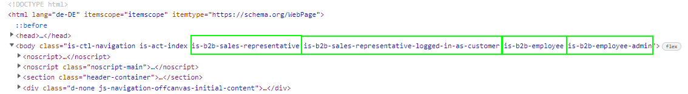

# B2B Body Classes

## **What are the B2B Body Classes?**

The B2B body classes are in the storefront usable \<bodyclass="XXX"> body classes, which are different depending on the B2B platform context. Consequently, individual stylings can be realized for different login states.

## **The following B2B body classes are available:**

* is-b2b-sales-representative
* is-b2b-sales-representative-logged-in-as-customer
* is-b2b-employee
* is-b2b-employee-admin
* NEXT: is-b2b-employee-role-XXXXX (name)

#### Note (Alert):

If one is not logged in or the logged in "customer" is a private customer, no class will be added

#### Examples:

