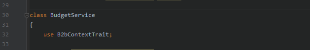
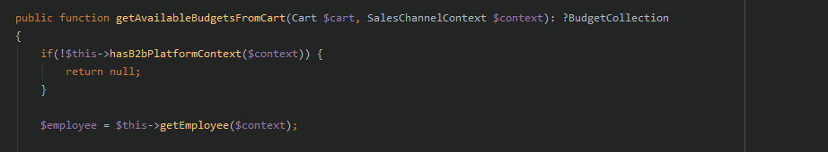

# B2bContextTrait

**What are PHP Traits?**

Since PHP 5.4.0, there is a method of reusing code in PHP called traits. Traits is a mechanism for reusing code that is used in programming languages with simple inheritance such as PHP.

**Why is the B2bContextTrait useful for your individual extension?**

With the B2bContextTrait you can make in your PHP Code a simple function to distinguish the customer ("Customers"). Is the logged-in customer an end customer, an employee/user of a customer or is he a sales employee, you can also query whether the sales employee is currently logged into an end customer.

What are the possible functions:

| Function                                | Description                                                                                                                         |
| --------------------------------------- | ----------------------------------------------------------------------------------------------------------------------------------- |
| hasB2bPlatformContext                   | Is the B2BPlatformContext set. This means whether the customer/user is logged in and is either a customer user or a sales employee. |
| getB2bPlatformContext                   | Return of the B2BPlatform Context (Type: B2bPlatformContext)                                                                        |
| isLoggedInAsSalesRepresentative         | Is a sales employee logged in.                                                                                                      |
| isLoggedInAsEmployee                    | Is the logged-in user a user/employee of a customer.                                                                                |
| getEmployee                             | Return of all employee fields (type: EmployeeEntity)                                                                                |
| isSalesRepresentativeLoggedInAsCustomer | Is a sales employee currently logged into a customer employee.                                                                      |
| customerIsSalesRepresentative           | Always returns true: when you are logged in as a sales agent and when you are logged in to a customer as a sales agent              |

#### Note (Alert):

You must always hand over the SalesChannelContext as a parameter.

How can you use our B2bContextTrait in your Shopware extension?

With the "use" function you can add the trait to any PHP class...

And then call the classes from the trait via $this->\[function-name].

