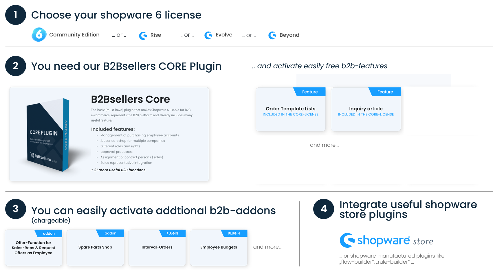

# Plans & Plugin Concept

### The B2Bsellers Plugin Structure

The B2Bsellers Suite structure is simply explained. You install the B2BsellersCore. After that you can activate all features or purchasable addons directly in the administration in the B2B Settings > License Settings.

Of course, you can always install useful plugins from the Shopware Community Store to meet customer requirements.

The B2Bsellers addons (e.g. offer function, spare parts ...) are Symfony bundles and structured in their own folders easy to understand. So they can be easily activated or deactivated and the source code is easy to understand.

Only the theme plugins are not included in the B2BsellersCore. They have to be installed as a separate plugin.

<figure><figcaption>
Install the B2BsellersCore Plugin and use all Features
</figcaption></figure>

### License, Features and Addons

Here you can see how easy it is to activate or deactivate features (free features included in the B2Bsellers license) or addons (paid features).

**Here you get more informations:**


[license-purchaseable-addons-and-features-configuration.md](../user-guide/configuration/license-purchaseable-addons-and-features-configuration.md)


### &#x20;.png>)

### License model

The B2Bsellers Suite is a 100% [Shopware 6](http://shopware.de/) compatible extension which is fully integrated into the Shopware 6 store software.&#x20;

It is a **proprietary software**, which means that the license has to be purchased from B2Bsellers GmbH.&#x20;

[Click here](https://www.b2b-sellers.com/de/lizenzbedingungen/) for the license information of B2Bsellers Suite


**You can test the B2Bsellers Suite extensively**, whether in our [public demo store](public-demoshops.md), in a [demo store created for you personally](get-a-personal-b2b-demo-store.md) or by giving you the source code for testing and demonstration purposes on your system.

