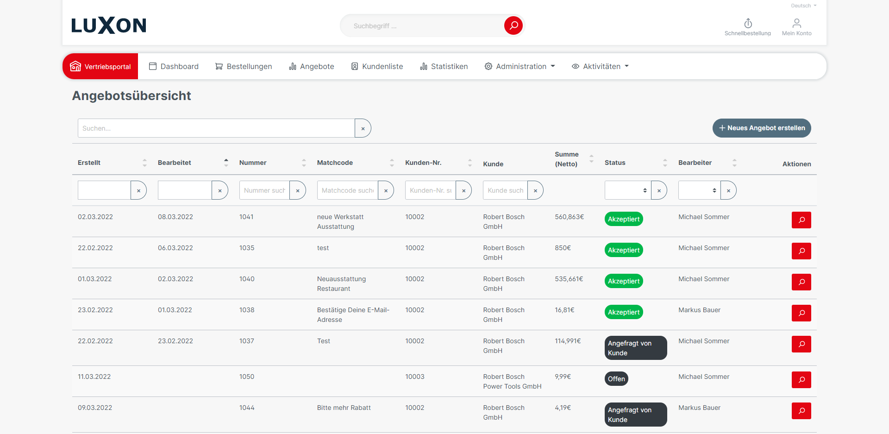

# Offer Function for Sales Agents

Reduce up to 50% of process costs with our unique offer function, which should replace the ERP offer function so that the sales team and buyers can work together interactively on a platform.

The buyer is given the option in the shop to start an offer request, e.g. from the shopping cart.  This offer will be forwarded directly to the responsible sales staff (or several). The sales staff can edit the offer directly on the sales staff platform. This eliminates the detour via the shop operator's ERP system. The sales staff can place the offer directly in the buyer's account. The buyer receives an e-mail notification with the option to commission the offer (even complex offers with optional positions) with one click.

## **Advantages**

* Closer to the customer
* No need to change systems
* Request an offer from a shopping cart or create a PDF offer and order or reorder with one click
* All offers and orders are in one place
* Simply add offers to the offer via smartphone EAN scan (in planning)
* No restrictions compared to ERP offers
* All position types such as headings, subtotals, optional items**,** or product-independent positions can be added.
* Significant reduction of internal process costs.

## Functionality

There are two different ways for buyers to get an offer:

### **Download PDF offer**

By clicking on the button "Download PDF offer" in the shopping cart, a pop-up window opens. The buyer is prompted to select the already stored billing and delivery address. Input fields are available for a better and clearer administration of the offers later on.

By clicking on "Create PDF offer", a mail with the shopping cart as a PDF offer and an offer number will immediately be generated and sent to the buyer. Further processing by the sales staff of the individual positions is not possible.

The document Matchcode is the title of the offer.

The status of the created offer is set directly to "open".

Advantage: Predominantly for authorities and companies that necessarily need an official offer as a PDF/printout, can create with just one click from the shopping cart an official offer with an offer number - 24x7. The sales staff does not check the created offer.

.png>)

### **Request as an offer to the sales team**

Clicking on the "Request an offer" button in the shopping cart also opens a pop-up window. The offer request will be automatically assigned to the sales staff stored for the customer.

If the checkbox for "Remarks added to individual positions" is activated, comments can be added to each position. This is the main difference in this way because the sales staff is given the opportunity to edit the offer, accept positions, make discounts, or suggest optional items to the buyer.

By clicking on "Create offer", an e-mail will be sent immediately to the assigned sales staff(s).

Info: All sales staff linked as contact persons receive a notification email. However, only the first allocated sales staff becomes the assigned sales staff in the offer.

## **Actions of the sales staff**

The requested offer is displayed directly in the offer overview of the sales staff platform.

Based on the status "Requested by customer", the employee can see that the request has not yet been processed. He can also filter the offers assigned to him.

1.  Changing customer details

    Both customer information and document information can be adjusted or completed.
2.  Viewing and adjusting items

    All positions requested by the customer are displayed and can be individually adjusted. Additional items can be added to the offer and also additional positions in the form of sub-headings (e.g. recommended items), discounts, optional products, product-independent positions or even subtotals. Therefore, the sales staff has all the rights**.**
3.  Enter texts

    An introductory text is preceded to the offer items.

    A closing text appears below the offer items.
4.  Show preview

    The sales staff has the option of displaying a preview of the offer.
5.  Show activities

    In addition, sales staff can comprehend the customer's activities and further actions, such as ordering a call-back.

By clicking on "Send offer" a pop-up window opens with a draft mail. This draft contains a direct link to the offer and can be edited individually by the sales staff. If the checkbox "Set status to open" is activated, the status in the offer overview will be changed when the mail is sent. Via the "Send" button, the offer will be sent directly to the customer.

There is also an activity list for each offer. These activities are automatically tracked and made available to the sales staff in chronological order. He can also write his own comments as well as specify the type of comment such as telephone or e-mail.

Automatically recorded activities are e.g.:

* When did the buyer look at the offer.
* When was something edited by the sales team.
* When did the buyer confirm the offer.

## **Actions of the customer**

If the customer opens the link in the offer email, he will be forwarded directly to the offer commission pop-up in the B2B platform. It is required to be logged in. The "Release order" pop-up will open. Here, the logged-in buyer has the option to order the offer or to confirm optional products in the offer. The final amount will be adjusted automatically. Via the button "Order with payment", a normal Shopware-Order will be triggered. In the offer overview, the status will be changed to "accepted".

## **Configuration in Shopware Admin**

"Product for custom articles"

Enter a dummy product here, which should then be stored in the offer for all the products that are not in the shop assortment. We use this dummy product number in the order position with the stored price, name, etc. However, the advantage is that the ERP interface or the ERP system can interrupt the automatic logistics process when the orders are called up if the ERP system can be checked in the order import.

Recommendation: We recommend creating a dummy product with the name "user-defined item" in the ERP system. This can be stored here and made invisible in the shop.

This way, the ERP system knows that the respective order item is a non-standard assortment item.

In the following, the default values for confirmation status can be selected:

* Open offers
* Requested offers
* Ordered offers

as well as the "Standard validity of offers in days".

## **Planned features**

* Simply add offers to the offer via smartphone EAN scan.
* Currently, only logged-in B2B customers can order the offers with one click. However, private customers without platform access cannot. In planning, the ordering process is to be carried out via an individually designed landing page, which the customer can then use to place the order at the bottom of the page.
* Queries/communication about the offer (messaging)
* A "Request offer" button is to be added to each product so that individual products can be requested. If you then request further products, you will be asked whether this should be added to the previous offer request or whether a new offer request should be created.
* Requests for offers from the order templates.
* Add a different delivery address in the offer request pop-up.
* Offer services even more easily.
* Create and use offer templates
* Add cross-selling or accessories for upselling intelligent.
* Assortment item names should not be editable, only an addition in the description can be added. The product name can then only be changed for product-independent positions.

## **Features planned for the long term**

The offer function is one of the most important features of customer communication. That's why we want to put a lot of energy into this to provide sales staffs with the best offer function they know. It doesn't matter if it's a big project offer with a lot of services or normal merchandise. Since the shop database contains all the necessary information about customers, their activities and products, we can provide the sales staffs with even more innovative features in the offers, so that they can sell more and consider the B2B platform as a great additional benefit.

## Entities


[offer](../../api-references/entities/offer/)



[offeraddress.md](../../api-references/entities/offer/offeraddress.md)



[offercustomer.md](../../api-references/entities/offer/offercustomer.md)



[offeritem.md](../../api-references/entities/offer/offeritem.md)



[offerstatus.md](../../api-references/entities/offer/offerstatus.md)



[customeractivity](../../api-references/entities/customeractivity/)



[customeractivitytype.md](../../api-references/entities/customeractivity/customeractivitytype.md)

