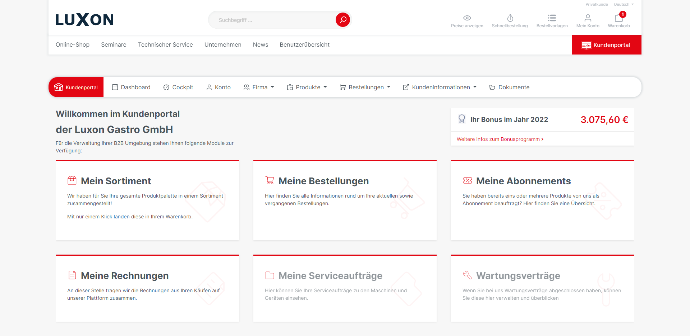
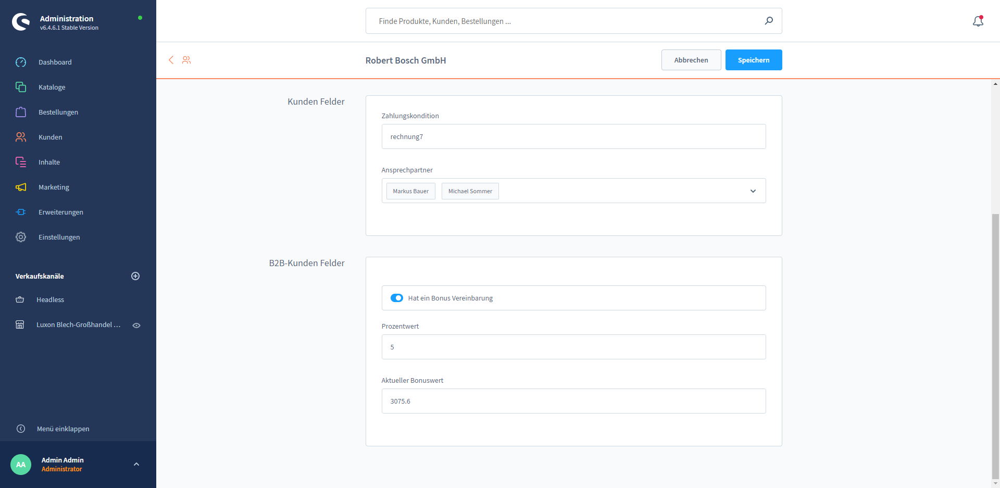

# Bonus program

The shop operator has the option of granting his customers benefits for online purchases made. The bonus program is included as a plug-in extension B2BBonusProgram in the CORE license of the B2Bsellers Suite.

## **Functionality**

The display of the bonus program in the shop frontend takes place via the output of a variable provided in TWIG. However, you can also use an experience element already provided in the B2B platform dashboard for the output of the available bonus amount. It is possible to determine whether a customer participates in the bonus program at all and you can also set whether a buyer may view the bonus value and thus also redeem it.

For orders placed, the bonus is calculated on the basis of the percentage value stored (additional field on the customer) and credited to the customer's bonus account. Optionally, the bonus can be redeemed by the customer in the shopping cart. For this purpose, the bonus is compensated in relation to the value of the shopping cart. The value on the bonus account will be automatically reduced by the amount offset.

### **Features**

* You can decide which customer takes part in the bonus program.
* The % bonus per online order can be set individually for each customer.
* The customer's bonus account is visible.
* The bonus value of individual orders can be comprehended.
* Visibility can be restricted for individual shoppers.
* The bonus can be redeemed in the shopping cart for activated shoppers.
* The bonus is always collected for the customer, not per shopper.

### **B2B customer fields**

You can find the settings for the bonus program under "Administration"  --> "Customers". Select the relevant customer and open the tab "B2B specifications".

_"Has a bonus agreement"._

By activating the slider switch, the bonus program will be initiated for this customer.

_"Percentage value”_

Enter the percentage value which should be credited to the bonus value from the purchase total.

_"Current bonus value"_

The current bonus value of the customer is displayed here.

### **Displaying the bonus value of individual orders**

Navigate in the administration to "Orders" -->"Overview" -->"Open corresponding order"--> "General"--> "Additional fields". The bonus value generated by the order will be displayed under the tab "Bonus program order".&#x20;

### **Redeemed bonus value in the shopping cart**

Navigate in the administration to "My extensions" --> and open under "B2Bsellers Suite - Bonus program " in the overflow menu (3 dots) the "Configuration".

If the slide switch is activated, the approved buyer can have his bonus value offset against the purchase total in the shopping cart.

**Tip**: If deactivated, it is possible to credit the bonus value once a year as part of a marketing campaign.  But there are currently no plans for an automatic solution.

### **Restricting the visibility**

The visibility of the bonus value can be set both in the Shopware Admin by the shop operator, as well as by the administrator of the customer in the frontend for each customer and also for each buyer separately.

Navigate to "Dashboard"-->"Manage Company"-->"Employees"

## **Planned features:**

* Exclude adjustable categories from the bonus calculation.
* Display the bonus value for each order

