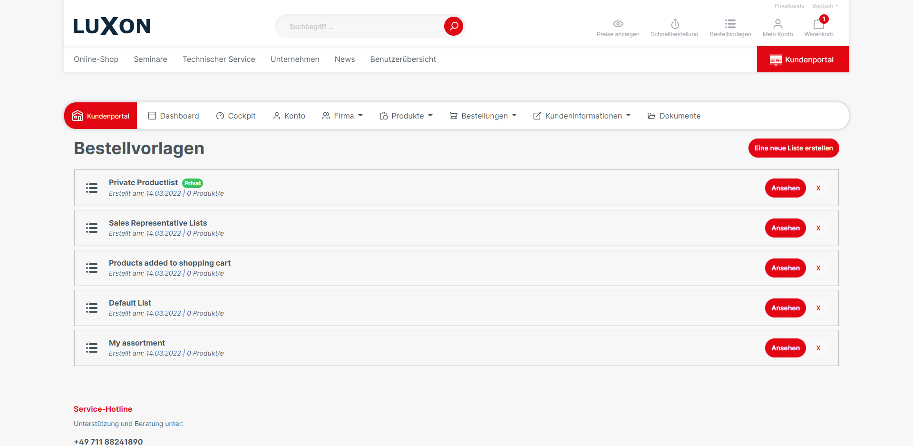

# Order lists

Known from the B2C-sector as wish lists or notepads, the B2Bsellers Suite provides order lists (also called order templates or product lists). The order lists are acquired with the Core- Plugin, however, must be downloaded and installed as a standalone plugin (B2bProductLists).

## **Mode of operation**

The logged-in B2B-costumer gets the button "On the order list" in the product box in the product listing and on the item detail page. If you open the drop-down menu, all available order lists will be displayed. If the item is already in an order list, this will be shown by a green tick before the order list. Alternatively, a new order list can be created.

Through the Icon "Order lists" in the header you get the overview of all created order lists. \
This menu item is also visible in the B2B platform navigation.

In the database, any type of order lists can be created. These order list types can be used for all customizations and accordingly configured in the plug-in config.

### **By default, the following lists are provided**

* My assortment
* Default
* Products added to the shopping cart
* Sales Representative Lists

### **Features**

* Creation of private order lists
* Usage of Cross-employee (company-wide) possible
* Intelligent order lists are automatically filled with items based on triggers. (e.g. when items have been placed in the shopping cart but not purchased or when a customer has visited a product detail page for longer than 30 seconds)
* Items can be placed in an order list by each customer
* Search function within an order list
* Adding item-comments to an order list
* Placing items from the order list in the shopping cart
* Entire lists can be deleted by the customer depending on the authorization/plug-in config.

## Technical info

The order lists in the frontend were developed in two different ways. Normal JavaScript for no "B2B Platform customers" and for all users who have access to the B2B Platform, the order lists were developed on the basis of Vue.js and bring their full advantages.

## **Planned features**

If the "Offer function" is activated, offers can be requested directly from order lists.

## **Plugin configuration**

**"Display for non-logged-in visitors?"**

When activated, "non-logged-in users" may create order lists and place items in order lists, however, these order lists are only saved in a browser session instead of at the customer, so they may be gone again at the next visit.

**"What types of product lists should the unauthenticated and logged-in customer be able to see?"**

Select the list types that should be visible to non-logged-in users or logged-in employees.

**"Which types can be deleted by the customer, employee?"**\
Select list types that can be deleted by users or client employees. \

**"Default Order List Type if no type is stored".**\
Select the type that should be used by default as the new order list if no special type is stored.&#x20;

**"Default Order List Name"**\
Choose a name that the list uses by default e.g \
"My Order List | My Order Template | My Wish List"

### **Automatic order lists**

Automatic product lists are created in the background and can be visible either only to the sales staff, but also to the customers themselves (through the plugin configuration).

### **"Creating "My assortment" product list after ordering".**

When activated, ordered items are automatically added to the "My assortment" order list.

if you want to link directly to the "my assortment" list, you can use the following link [https://\<shop-url>/product-lists/my-products](https://development.tischer.de/product-lists/my-products)

### **"Default Order List Type, at " My Assortment" Product Lists?"**

Specify which list type the "My assortment" product list should correspond to. In this way, you can control the authorization of the display.

create a frequently ordered product-list

### Creation of "Frequently Ordered" product list

With this checkbox, you can activate that all frequently ordered items (by default all items that were ordered more than once) will be placed in a new automatic smart order list.

If a customer should be able to see this list it is important to go to B2bProductLists > Settings to the question **"What types of product lists should the unauthenticated and logged-in customer be able to see**?"

Add the order type.&#x20;

If this is not done, only the sales agent can see the list.

**" Creation "Shopping cart item" product list after adding to shopping cart".**

When activated, items placed in the shopping cart are automatically added to an order list. However, if the item is subsequently purchased, it will be deleted again from this list, so in this list, there are items which have been added to the shopping cart but are not purchased. These may be available to the sales representative.&#x20;

**“Standard Order list type, for items placed in the shopping cart?”**

&#x20;Define which list type the "shopping cart item" product list should correspond to.

### &#x20;"B2Bsellers Suite in use?"

When activated, the Vue.js interface is displayed and the order lists are assigned to logged-in employees instead of customers.

When deactivated, the interface is displayed in JavaScript.

"For employee accesses, show order lists of all linked companies?"

When activated, the order lists of all linked companies will be displayed to the employees, instead of those of the logged-in customer.

## Default config settings

When you install the addon, there are no default settings defined in the current B2Bsellers Suite version (1.0.3). You have to define them by yourself.

Of course you can configure the addon as you like, but to make the configuration easier, we recommend the following default configuration.

We plan in the next releases to provide a default configuration when activating the addon to prevent problems.

<figure><figcaption>
default setting of "order list" feature #1
</figcaption></figure>

<figure><figcaption></figcaption></figure>

## Entities


[b2bproductlist](../../api-references/entities/b2bproductlist/)



[b2bproductlistitem.md](../../api-references/entities/b2bproductlist/b2bproductlistitem.md)



[b2bproductlisttype.md](../../api-references/entities/b2bproductlist/b2bproductlisttype.md)

