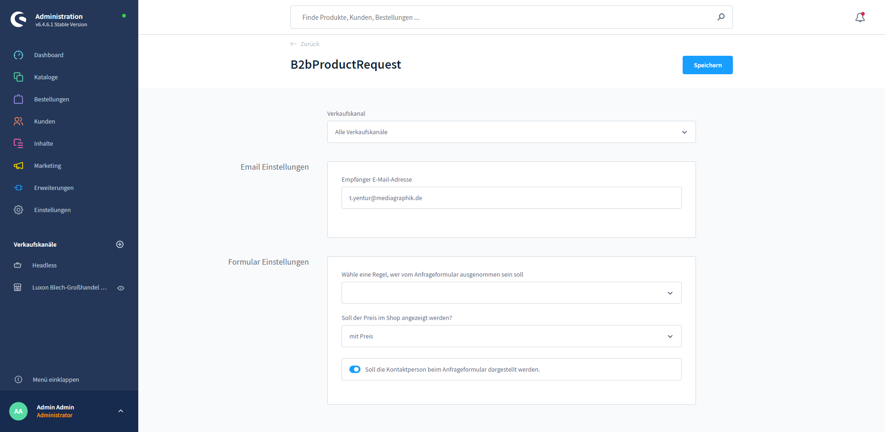

# Product Request

The shop operator has the option of marking a product as a request product via the additional fields, so that the product can only be requested via a form instead of being placed directly in the shopping cart.

### Functionality

The setting will be made via the Product Custom Fields for the respective product. It is possible to specify exceptions to the form display via the Shopware standard rule builder. This can be done either globally for all products in the plug-in configuration, or locally for each individual product overwritten with a different own rule.

It can also be set in the configuration or individually for each product whether the price is displayed in the request form or not. Optionally, it can only be set in the configuration whether the corresponding contact person of the customer will be displayed next to the form, if available.

In the configuration, a global recipient e-mail address can be stored for all forms.

### Features

* Each product can be adjusted as a request product via Shopware standard additional fields
* Exclude certain products from the form display in a rule - both globally and locally
* Show or hide price
* Display the contact person of the buyer above the form
* Automatically pre-fill personal data of the form if buyer or customer is logged in

## **Additional fields**

### **P**roduct settings

You can find the settings for the product request for the respective product under "Product"--> "B2B-Specifications"-->"Additional fields" -->"Product request fields".

_"Request form activated"_

By activating the slider, this product becomes a request product.

_"(Do not) Show request form for the following groups:"_

Here you can select the rule that determines which group can buy the product directly without the form.

**Attention**: if a rule is selected here, this rule overwrites the global rule that can be selected in the configuration for the respective product.

_"Price"_

Here is determined whether the price is displayed or not.&#x20;

**Attention**: if a rule is selected here, this rule overwrites the global rule that can be selected in the configuration for the respective product.

### Plugin settings

Furthermore, there are settings that are applicable to all request products. You can find these under "Extensions"-->"My extensions" the menu items of the plugin "B2Bsellers Suite - Request product"-->"Configuration".

_"Recipient email address"_

Here you can enter a recipient e-mail address

_"Select a rule who should be excluded from the request form"._

Here, a global rule can be selected for who can order the product directly without a request form. \
**Attention**: it can be overwritten locally in a product by another rule for the product there.

_"Should the price be displayed in the shop?_

Here it is determined whether the price is displayed or not. (Default: without price) \
**Attention**: it can be overwritten locally in a product by another rule for the product there.

_"Should the contact person be displayed on the request form?"_

If the slider is activated, the contact person of the customer will be displayed on the request form, if one is assigned.

## **Planned features**

Currently, all requests are sent to the central e-mail address from the plug-in configuration. In the future, it should be possible to define this for each product. In addition, it should be possible to overwrite, whether (if there is a customer for the contact person) the contact person should also be informed about the request.

## Entities
