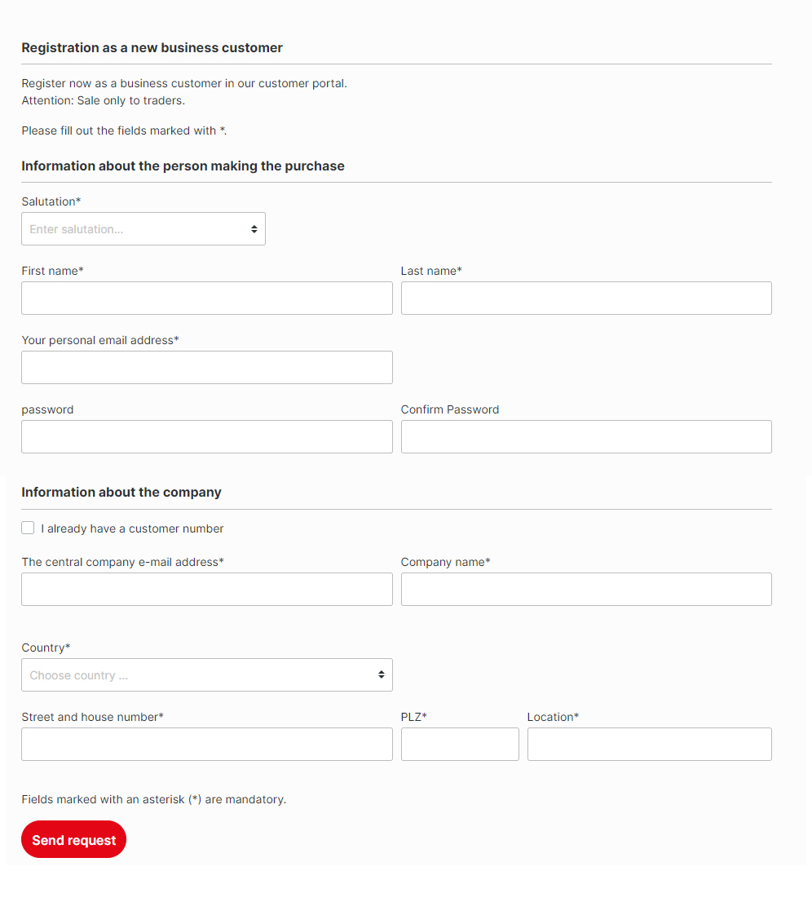

# Register Requests (wip)

As of March 2022:&#x20;

We have started to develop this B2Bsellers extension and will release it soon.&#x20;

### Brief description:&#x20;

With the registration process with approval process, we would like to approve or reject individual registration requests as a sales agent or migrate to an existing customer as an employee.

This should be an extension to what the Shopware registration for B2B customers overwrites and outsources to an extra controller.

### Entities


[registerrequest](../../api-references/entities/registerrequest/)



[registerrequestactivity.md](../../api-references/entities/registerrequest/registerrequestactivity.md)



[registerrequeststatus.md](../../api-references/entities/registerrequest/registerrequeststatus.md)

