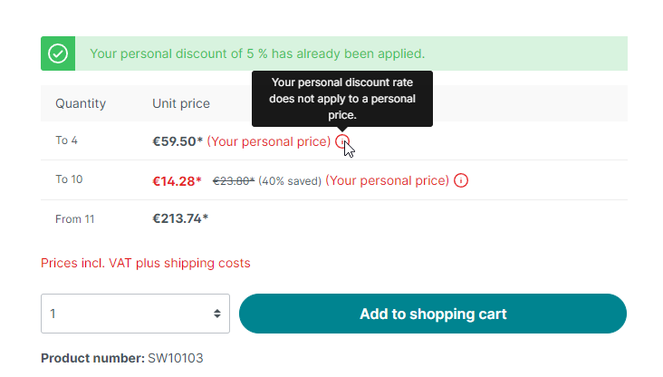

# Customer specific prices

## Adding customer specific prices

### via Shopware Admin

You can easily provide new custom prices manually via Shopware admin area.

<figure><figcaption><p>Add Customer specific prices via shopware admin</p></figcaption></figure>

### via API

You can easily create new custom prices via Shopware Admin API (Shopware Standard).&#x20;

Endpoint: POST json [https://your-domain.com/api/b2b-customer-price](https://your-domain.com/api/b2b-customer-price)

Or ... just use the "admin-api/sync-api" of shopware for batch-process.

Entity: b2b\_customer\_price


Here you'll find more informations about the sync-api (bulk / batch payload)\
[https://docs.b2b-sellers.com/b2b-platform/api-references/admin-api/general-admin-api-info#bulk-payloads](https://docs.b2b-sellers.com/b2b-platform/api-references/admin-api/general-admin-api-info#bulk-payloads)


### Create customer specific prices without UUID's (Product and Customer)

We know that a lot of ERP vendors or interface providers still provide data using traditional methods. For example, also via an SQL insert. For this reason we have provided you with two optional fields: customer\_number and product\_number.

You can fill these two fields and leave the customer\_id + product\_id fields (which require a UUID) blank.

Then you can use our provided command to convert customer\_number's and product\_number's to uuids.

<pre><code>// command
<strong>php bin/console b2b:entity:map
</strong></code></pre>


More information: [https://docs.b2b-sellers.com/b2b-platform/developer-guides/first-steps/cli-commands#entity-mapping-command](https://docs.b2b-sellers.com/b2b-platform/developer-guides/first-steps/cli-commands#entity-mapping-command)


You can also fill the customer\_id and product\_id directly if you have the data available.

## Special features

### The customer individual price overwrites all other calculated prices

You should know that if a customer individual price is stored, this is drawn last and is therefore the last level of the price calculation. Even if you have stored a customer discount rate (addon), this is not taken into account and overwritten by the customer-specific price.

### Graduated prices in connection with customer-specific prices

A big advantage of our custom prices is the possibility of full scale pricing, even in combination with Shopware standard prices. Thus, even such a configuration is possible:

* 1-5 pieces - Shopware calculated price via extended prices
* 6-15 pieces - customer individual price
* 16-30 pieces - Shopware calculated price via extended prices
* from 31 pieces - ccustomer individual price


This graduated price calculation is a key advantage over other suppliers


### Performance / big data with customized prices

Basically, all sizes of customer individual prices can be covered! In our Highlast-Demoshop more than 3 million customer individual prices are maintained. Our approach in the background is designed for large amounts of data.

### Time-based validity of customer-specific prices

You can specify a validity of individual customer prices. Period of validity from/until. This means that a custom price is valid only in this period.

Attention, you have to set in B2Bsellers Suite -> CORE plugin configuration that the validity period should be respected. (This setting is necessary for performance reasons)

Use the following command to remove the prices that are no longer valid from the database:&#x20;

```bash
php bin/console b2b:clean:expired-customer-prices --force
```

### How are customer-specific prices displayed in the storefront?


#### Example: Customer individual price of piece 1 to X

Since there is only one price here, the complete price is exceeded and a label is added so that the customer knows that this is a special arrangement.

<figure><figcaption></figcaption></figure>

#### Special case when discount rate and customer-specific prices are available for a product

<figure><figcaption></figcaption></figure>
