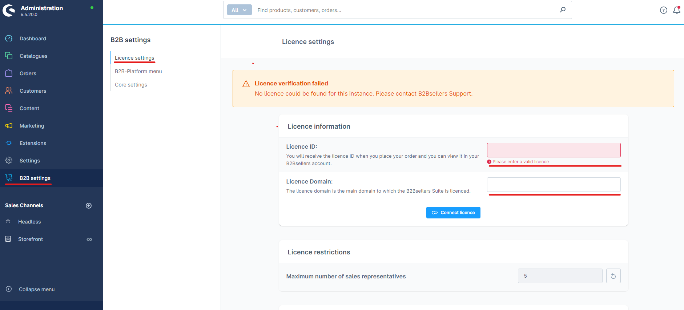
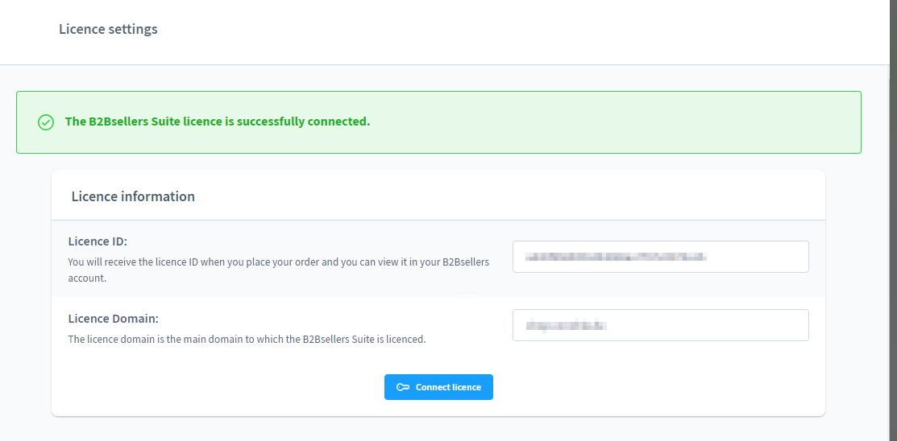

# License Settings

We are glad that you have chosen the complete solution for B2B e-commerce with Shopware 6. Enjoy and benefit from the countless advantages of the B2b Sellers Suite.&#x20;

In order to use the plugin as agreed, you must register your purchased license at the end.

After the successful purchase of your license, you will receive a welcome email from us. This will contain your personal license key. To register in your store, go to the admin area under B2B Settings > License Settings.

Enter your ID in the Licence ID field and enter your store domain. Now click on "Connect license" to successfully connect the store with your license.

HINT: If you receive an error, please contact our support team (sales@b2b-sellers.com) immediately.
